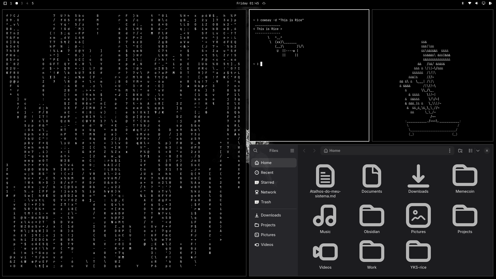

# Monochrome — Omarchy Theme


A minimal **dark monochrome** theme for [Omarchy](https://omarchy.org/).

## Preview



## Installation

Install via **Install > Style > Theme** in the Omarchy menu, then paste:

```
https://github.com/yks777/omarchy-monochrome-theme
```

Or from the command line:

```bash
omarchy theme install https://github.com/yks777/omarchy-monochrome-theme
```

Then apply it:

```bash
omarchy theme set monochrome
```

## What's Included

| Asset | Description |
|-------|-------------|
| `colors.toml` | Dark-mode color palette |
| `icons.theme` | Icon theme reference (Yaru-gray) |
| `backgrounds/` | Wallpaper collection |

## Color Palette

| Role | Hex |
|------|-----|
| Background | `#000000` |
| Foreground | `#ffffff` |
| Accent | `#ffffff` |
| Muted | `#7a7a7a` |
| Selection | `#1a1a1a` |

## Backgrounds

The theme ships with a set of wallpapers in the `backgrounds/` folder. To apply one, copy or symlink it to your Omarchy background location.

## Requirements

- [Omarchy](https://omarchy.org/) installed and configured

## License

[MIT](./LICENSE)
